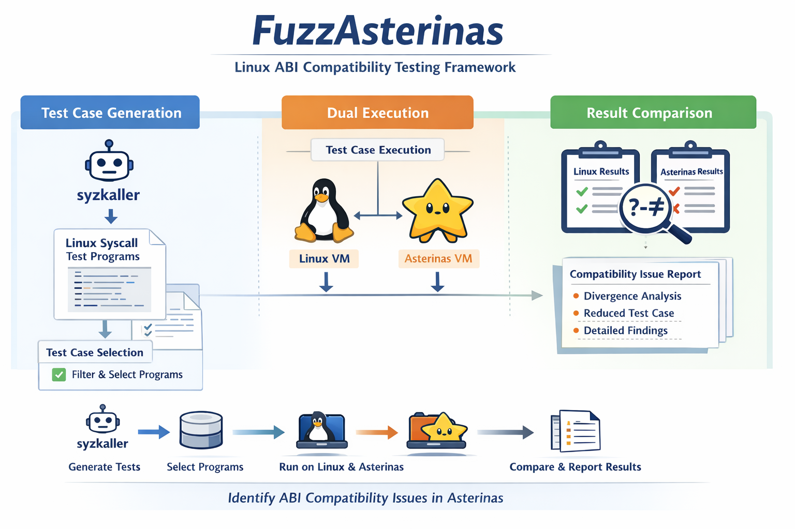
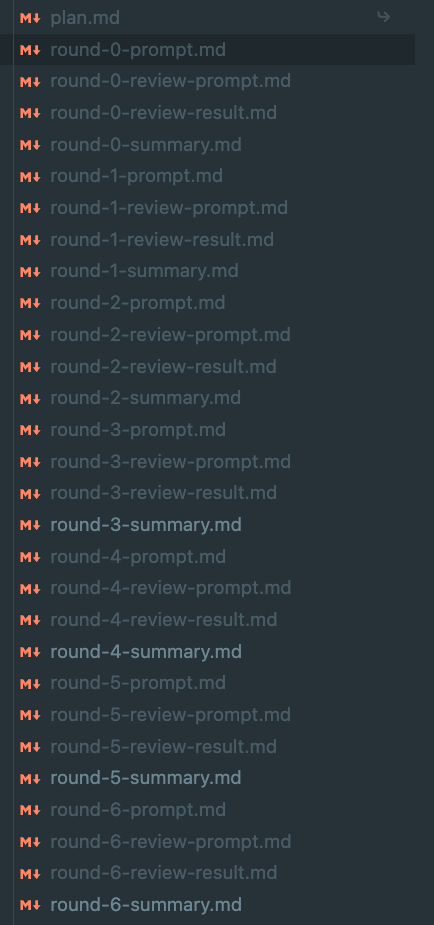

# 面向 Linux ABI 兼容 OS的差分测试

## 项目概述

复用 syzkaller（Linux系统的模糊测试框架）生成的 Linux syscall 程序，在 Linux 和 Asterinas 上分别执行同一组测试用例，对比两边的系统调用返回值、错误码、资源状态和最终执行结果，自动发现 Asterinas 与 Linux 在 ABI 语义上的行为差异。它的目标不是单纯找 crash，而是系统化发现“不兼容、不一致、不符合预期”的接口行为问题。

## 项目功能

这个项目的核心作用，是把“Linux ABI 兼容性”从描述变成可自动验证、可复现、可分析的问题发现流程。具体来说，它可以自动导入和筛选 syscall 测试程序，分别在 Linux 和 Asterinas 中运行相同 workload，采集两侧执行轨迹和结果，识别行为分歧。也就是说，它本质上是一个“针对 Asterinas 的 Linux 行为对照测试与漏洞挖掘工具”。

## 架构设计

## Agent使用

Agent 主要用于制定和推进实现计划。
首先给 Agent 一个总体目标，由 Agent 将整个项目拆分为三个阶段；再将每个阶段进一步拆分为若干组件；
每个组件继续细化为多个子目标。随后围绕每个子目标进行代码实现，并采用“实现一轮、Review 一轮”的迭代方式持续推进。
在每一轮过程中，Agent 都会生成相应文档，记录当前设计、实现进展、问题分析和后续计划；这些文档按阶段和组件归档到对应目录中，供下一轮继续基于文档和现有代码演进。

- 根据总体目标拆分几阶段计划
- 将每个阶段细化为组件和子目标
- 按子目标逐步实现代码
- 每轮实现后进行 Review
- 持续生成并归档阶段文档
- 下一轮基于文档和代码继续迭代

在项目后续迭代中，进一步引入了 Agent 参与问题定位与修复。具体做法是：根据测试过程中返回的错误码，Agent 自动对比 Linux 与 Asterinas 在对应 syscall 上的行为差异，分析两边实现不一致的原因，并定位到具体的代码位置。
在这一流程下，Agent 自动检查并推动修复了两处 pipe2 相关问题：
一处是 非法 flag 没有被正确拒绝，另一处是 pipe2 的状态标志没有被正确传递到生成的 pipe 文件句柄上。对应修复体现在 Asterinas 的 PR #3066，并补充了针对 pipe2 非法 flag 的测试用例。

https://github.com/asterinas/asterinas/pull/3066